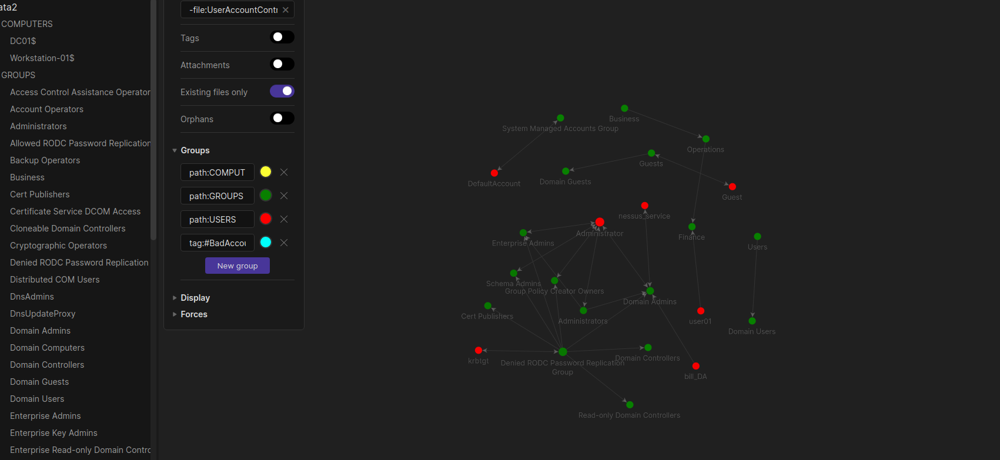
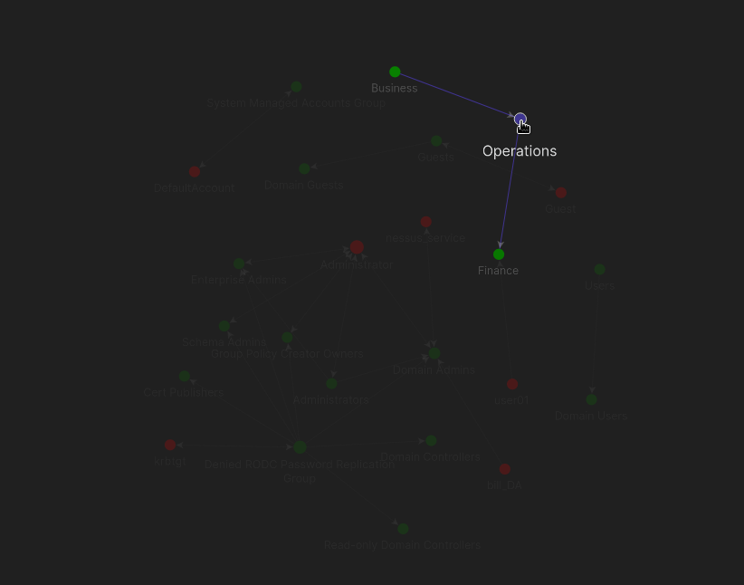
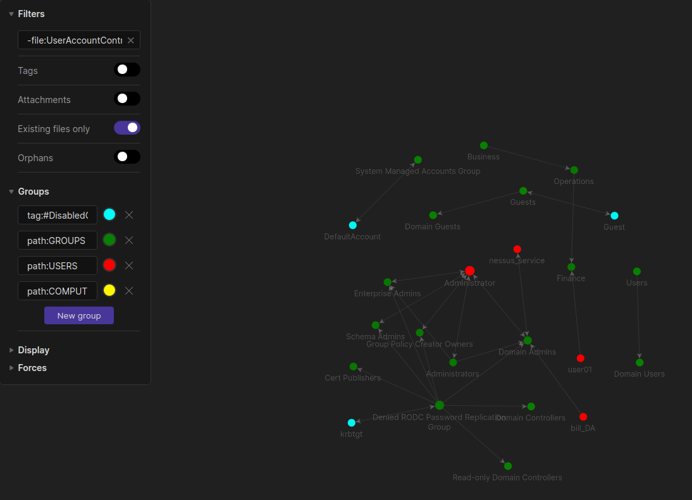

# Shihtzu - Active Directory Parser for Obsidian

Shihtzu parses Active Directory (AD) attributes from LDAP search results (dsquery or ldapsearch format), enriches the AD objects with some security-relevant information, and writes them into structured markdown files for Obsidian.

Obsidian is a handy markdown editor, but more importantly it contains a graph view, which Shihtzu uses to enable security professionals to map out nested group memberships and relationships between accounts, computers, and groups.

Less richly-featured than [Bloodhound](https://github.com/SpecterOps/BloodHound), Shihtzu is a lapdog for AD exploitation. Shihtzu is intended to be a light-weight alternative to Bloodhound when stealth requirements prevent you from running full Bloodhound in an enterprise.

## Demo
Clone this repo and download the most recent release to play around with some sample data, and look at an existing demo vault.

## Overview

Shihtzu extracts information from LDAP query results (typically in text format), processes them, and generates organized markdown files for easy analysis and reference in Obsidian. This enables security professionals and administrators to better explore, analyze, and document Active Directory environments.

## Features

- Parses LDAP attributes from text files into structured Obsidian markdown
- Intelligently categorizes objects as Users, Groups, or Computers
- Automatically identifies administrators and administrative privileges
- Detects potentially risky account configurations (stale accounts, low logon counts)
- Creates Obsidian links between related objects to enable network visualization
- Processes UserAccountControl (UAC) values with explanations
- Converts Windows timestamps to human-readable format
- Smart append mode that only adds new data to existing files
- Proper tagging for easy filtering and searching in Obsidian

## Installation

```bash
git clone https://github.com/pangolinsec/shihtzu.git
cd shihtzu
python3 shihtzu.py
```

## Usage

### Basic Usage

```bash
python shihtzu_claude_append.py -f ldap_output.txt -D /path/to/obsidian/vault
```

### Input Options

Shihtzu can process a single combined file or separate files for users, groups, and computers:

```bash
# Process a single file containing all LDAP output
python shihtzu_claude_append.py -f ldap_output.txt -D /path/to/obsidian/vault

# Process separate files
python shihtzu_claude_append.py -U users.txt -G groups.txt -C computers.txt -D /path/to/obsidian/vault
```

#### Input Requirements

Here are the bare minimum required attributes for Shihtzu to be able to run:

1. **objectClass** - Used to determine the type of AD object (user, group, computer)
    - Essential for proper categorization of objects
2. **distinguishedName** - Used to extract relationships and hierarchy information
    - Needed for processing members and parent relationships
3. **Common Name (cn)** - Technically this is optional, but it would require a code modification. Shihtzu needs to know how to name files, and right now I base filenames off the cn.
	1. you can lightly modify the code to use a different filename seed by modifying the `DEFAULT_FILENAME_SEED` constant.

Additional attributes that are processed when available but not strictly required for basic functionality:

- **memberOf** - Processed to determine group memberships
- **member** - Processed to determine group members
- **logonCount** - Used for identifying potentially inactive accounts
- **userAccountControl** - Used to determine account states and properties
- **Time-related attributes** (pwdLastSet, badPasswordTime, lastLogon, lastLogonTimestamp)
- **operatingSystem** - Used to help identify computer objects
- **adminCount** - Used for additional logic to track admin accounts.

I'd strongly recommend including at least `member` and `memberOf`, since that is what allows you to see user:group relationships.

The program will still generate output files without these additional attributes, but they provide valuable context and relationships between objects.


### Output Options

```bash
# Overwrite existing files
python shihtzu_claude_append.py -f ldap_output.txt -D /path/to/obsidian/vault --overwrite

# Intelligently append new data to existing files
python shihtzu_claude_append.py -f ldap_output.txt -D /path/to/obsidian/vault --append
```

### Configuration Options

```bash
# Set custom logon count threshold (default is 100)
python shihtzu_claude_append.py -f ldap_output.txt -D /path/to/obsidian/vault --logonCount 50

# Set custom logon date threshold in days (default is 30)
python shihtzu_claude_append.py -f ldap_output.txt -D /path/to/obsidian/vault --logonDate 60

# Use a different attribute for filename generation (default is "cn")
python shihtzu_claude_append.py -f ldap_output.txt -D /path/to/obsidian/vault --filenameSeed sAMAccountName

# Set a different delimiter for attribute parsing (default is ": ")
python shihtzu_claude_append.py -f ldap_output.txt -D /path/to/obsidian/vault --delimiter " = "

# Enable debug logging
python shihtzu_claude_append.py -f ldap_output.txt -D /path/to/obsidian/vault --debug
```

## Example LDAP Output Format

Shihtzu expects LDAP attributes in a text format with attributes separated by a delimiter (default ": ") and objects separated by an empty line or by "--------------------". You can customize the separator by modifying the DEFAULT_SEPARATOR variable.

You can use the following sample data for a very basic test of Shihtzu:

```
dn: CN=John Smith,OU=Marketing,DC=contoso,DC=com
objectClass: top
objectClass: person
objectClass: organizationalPerson
objectClass: user
cn: John Smith
sn: Smith
givenName: John
distinguishedName: CN=John Smith,OU=Marketing,DC=contoso,DC=com
instanceType: 4
whenCreated: 20230215104235.0Z
whenChanged: 20240312142156.0Z
displayName: John Smith
uSNCreated: 78954
memberOf: CN=Marketing Team,OU=Groups,OU=Marketing,DC=contoso,DC=com
memberOf: CN=VPN Users,OU=Security Groups,DC=contoso,DC=com
uSNChanged: 241578
name: John Smith
objectGUID:: a4F7h8Jk2ESOPmn6T/GDPA==
userAccountControl: 512
badPwdCount: 0
codePage: 0
countryCode: 0
badPasswordTime: 132245678933211234
lastLogoff: 0
lastLogon: 133521487623456789
pwdLastSet: 133456789012345678
primaryGroupID: 513
objectSid:: AQUAAAAAAAUVAAAAaeAO5dr9XLrK5B+fkwQAAA==
accountExpires: 9223372036854775807
logonCount: 157
sAMAccountName: john.smith
sAMAccountType: 805306368
userPrincipalName: john.smith@contoso.com
objectCategory: CN=Person,CN=Schema,CN=Configuration,DC=contoso,DC=com
dSCorePropagationData: 16010101000000.0Z
lastLogonTimestamp: 133521345678901234
mail: john.smith@contoso.com
department: Marketing
company: Contoso Ltd
title: Marketing Specialist
manager: CN=Lisa Wong,OU=Marketing,DC=contoso,DC=com
telephoneNumber: +1 (555) 123-4567

dn: CN=CONTSRV01,OU=Servers,DC=contoso,DC=com
objectClass: top
objectClass: person
objectClass: organizationalPerson
objectClass: user
objectClass: computer
cn: CONTSRV01
distinguishedName: CN=CONTSRV01,OU=Servers,DC=contoso,DC=com
instanceType: 4
whenCreated: 20230516081422.0Z
whenChanged: 20240325193017.0Z
uSNCreated: 98765
uSNChanged: 285412
name: CONTSRV01
objectGUID:: ZHJ6dv18pEyZ2LkJs65bNw==
userAccountControl: 4096
badPwdCount: 0
codePage: 0
countryCode: 0
badPasswordTime: 0
lastLogoff: 0
lastLogon: 133523698452314562
localPolicyFlags: 0
pwdLastSet: 133450123654789012
primaryGroupID: 515
objectSid:: AQUAAAAAAAUVAAAAaeAO5dr9XLrK5B+gCAEAAA==
accountExpires: 9223372036854775807
logonCount: 1432
sAMAccountName: CONTSRV01$
sAMAccountType: 805306369
operatingSystem: Windows Server 2022 Standard
operatingSystemVersion: 10.0 (20348)
dNSHostName: contsrv01.contoso.com
servicePrincipalName: HOST/CONTSRV01
servicePrincipalName: HOST/contsrv01.contoso.com
servicePrincipalName: WSMAN/contsrv01
servicePrincipalName: WSMAN/contsrv01.contoso.com
objectCategory: CN=Computer,CN=Schema,CN=Configuration,DC=contoso,DC=com
dSCorePropagationData: 20240112151416.0Z, 16010101000000.0Z
lastLogonTimestamp: 133523654321098765
msDS-SupportedEncryptionTypes: 28

dn: CN=Jane Admin,CN=Users,DC=contoso,DC=com
objectClass: top
objectClass: person
objectClass: organizationalPerson
objectClass: user
cn: Jane Admin
sn: Admin
givenName: Jane
distinguishedName: CN=Jane Admin,CN=Users,DC=contoso,DC=com
instanceType: 4
whenCreated: 20221105135621.0Z
whenChanged: 20240330192134.0Z
displayName: Jane Admin
uSNCreated: 12456
memberOf: CN=Domain Admins,CN=Users,DC=contoso,DC=com
memberOf: CN=Enterprise Admins,CN=Users,DC=contoso,DC=com
memberOf: CN=Schema Admins,CN=Users,DC=contoso,DC=com
memberOf: CN=Administrators,CN=Builtin,DC=contoso,DC=com
uSNChanged: 295142
name: Jane Admin
objectGUID:: cFd8g21LlEeRzLkPo6AdtQ==
userAccountControl: 512
badPwdCount: 0
codePage: 0
countryCode: 0
badPasswordTime: 0
lastLogoff: 0
lastLogon: 133524765432109876
pwdLastSet: 133510987654321098
primaryGroupID: 513
objectSid:: AQUAAAAAAAUVAAAAaeAO5dr9XLrK5B9VBQAAA==
adminCount: 1
accountExpires: 9223372036854775807
logonCount: 867
sAMAccountName: jane.admin
sAMAccountType: 805306368
userPrincipalName: jane.admin@contoso.com
objectCategory: CN=Person,CN=Schema,CN=Configuration,DC=contoso,DC=com
dSCorePropagationData: 20230215121543.0Z, 16010101000000.0Z
lastLogonTimestamp: 133524765432109876
mail: jane.admin@contoso.com
department: IT
company: Contoso Ltd
```

## Output Structure

Shihtzu organizes the output into subdirectories within your Obsidian vault:

```
/obsidian-vault/
├── USERS/
│   ├── Administrator.md
│   ├── Guest.md
│   └── ...
├── GROUPS/
│   ├── Domain Admins.md
│   ├── Enterprise Admins.md
│   └── ...
└── COMPUTERS/
    ├── DC01.md
    ├── WORKSTATION01.md
    └── ...
```

Each markdown file is structured with sections for:

- Raw Data
- Tags
- Members (for groups)
- Parents (groups the object belongs to)
- UserAccountControl Values
- Clean Timestamps
- User Defined information

## Common Workflow

1. Export LDAP query results to a text file(s)
2. Run Shihtzu to process the data
3. Open your Obsidian vault to analyze the results
4. Use Obsidian's graph view to visualize relationships

## Challenges
I've tested Shihtzu against ldapsearch and dsquery output from several different AD environments.  The three most common problems I've seen crop up are:
1. Funky attributes with special characters that break the parsing logic
	1. I think this should be mostly fixed but please create an issue, or better yet submit a PR, if you experience problems.
2. Issues with duplicate or missing separators when concatenating files of different objects. (e.g. if you run `cat ldapUsers.txt ldapGroups.txt ldapComputers.txt > ldapFull.txt` and then use Shihtzu against `ldapFull.txt` you'll likely experience some problems. Just use the `-U`, `-G`, and `-C` flags to feed each file separately).
3. Line-breaks or other formatting issues injected by your C2, e.g:
```
--------------------
objectClass: top, person, organizationalPerson, user, computer
cn: wkstn1
distinguishedName: CN=wkstn1,OU=Workstations,DC=contoso,DC=loc
[12/11 08:07:17] [+] received output:
al
instanceType: 4

```

In short, Shihtzu parses AD objects, but it doesn't have logic built-in to clean that data first.
## Tips

- Use the `--append` flag to update your knowledge base without losing previous notes
- The smart append feature will only add new information to existing files
- Take advantage of Obsidian's graph view to visualize Active Directory relationships
- Leverage tags like `#BadAccount`, `#StaleLogons`, and `#IsAdmin` for filtering

## License

AGPL License

## Contributing

Contributions are welcome! Please feel free to submit a Pull Request.

# Example Output Graphs:

## Show membership flows:
This shows the graph, without orphaned nodes, showing membership paths.




## Drill into users and groups:
Here, we see that Operations is a child of Business, and a parent of Finance.
Although it is not highlighted, we can also see that user01 is a member of finance (the only gotcha here is that, for groups membership flows 'downhill' and that is indicated by the directional arrows, while for users membership flows 'uphill'. This is an artifact of how linking works in Obsidian).



## Highlight bad accounts:
Here, we can see that DefaultAccount, Guest, and krbtgt are all disabled or locked out accounts. They are highlighted in that light blue color because we have dragged the light blue group to the top.

Alternatively, we could simply filter out any accounts with that tag with:
`-tag:#DisabledOrLockedAccounts`



## Useful Groups:
Create the following groups and set them to easily-identifiable colors:
`path:GROUPS`
`path:COMPUTERS`
`path:USERS`

My preference is Green, Yellow, and Red respectively
